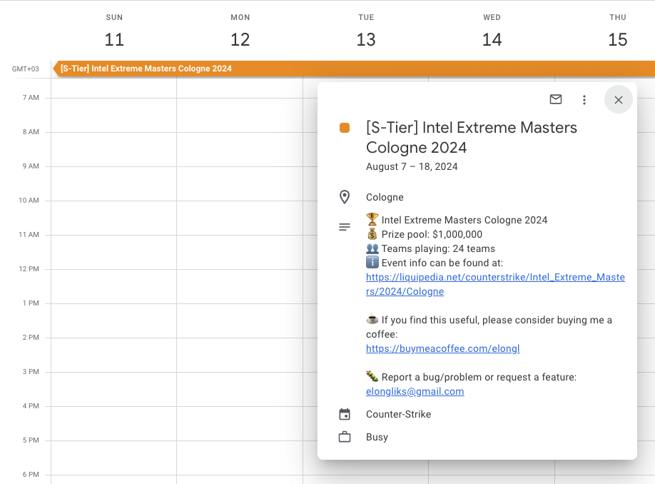

# Esports Schedule

Esports tournaments and events in your calendar 📅  
Stay up-to-date and never miss your favorite game's biggest competitions!



## Usage

Modern calendars allow you to subscribe to public calendars using a URL.  
Copy the desired link, based on the game, into your calendar's subscriptions:

- **Counter-Strike**: `https://esports.duckdns.org/calendar/counterstrike`
- **VALORANT**: `https://esports.duckdns.org/calendar/valorant`
- **League of Legends**: `https://esports.duckdns.org/calendar/leagueoflegends`
- **Dota 2**: `https://esports.duckdns.org/calendar/dota2`
- **Rocket League**: `https://esports.duckdns.org/calendar/rocketleague`
- **Apex Legends**: `https://esports.duckdns.org/calendar/apexlegends`

You'll now see your game's tournaments.  
Enjoy!

### Subscribing to Calendar

If you're troubling with adding the calendar, you can use these guides.

- **[Google Calendar](https://support.google.com/calendar/answer/37100?hl=en&co=GENIE.Platform%3DDesktop#:~:text=Use%20a%20link%20to%20add%20a%20public%20calendar)**
- **[Apple Calendar](https://support.apple.com/en-il/guide/calendar/icl1022/mac#:~:text=share%20calendars.-,Subscribe%20to%20a%20calendar,-To%20subscribe%20to)**

## Setup

```sh
pip install -r dev-requirements.txt -r requirements.txt
pre-commit install
```

## Running

### Server

```sh
fastapi dev main_server.py
```

### CLI

```sh
python main_cli.py <GAME>
```

## Testing

```sh
pytest -vvv
```

## Credits

- **[Liquipedia](https://liquipedia.net)**: Data source of the tournaments.
